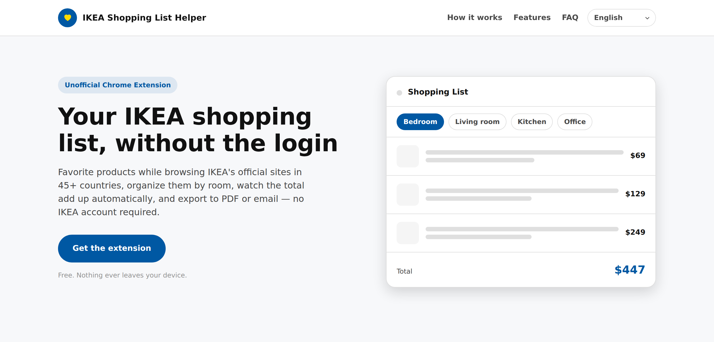

# IKEA Shopping List Helper — Landing Site

A small, static landing page for **IKEA Shopping List Helper**, an unofficial
browser extension that lets you build and manage an IKEA shopping list
without ever logging in.



This repo contains only the marketing/landing site (HTML/CSS/JS, no build
step). The extension itself lives in a separate repository:
[ikea-wishlist-extension](https://github.com/chienchitung/ikea-wishlist-extension).

## About the extension

IKEA Shopping List Helper intercepts the heart ("favorite") icon that
already exists on every IKEA product card and product page, and turns it
into a login-free way to build a shopping list.

- **No login required** — clicks on IKEA's native favorite button are
  intercepted before any login redirect can happen.
- **Organized by room** — 12 built-in categories taken from IKEA's own
  "shop by room" menu, fully customizable.
- **Automatic totals** — per-room subtotals and a grand total, updated
  live, matching the price shown on the official site.
- **Export to PDF** — a print-ready page with an embedded backup you can
  restore your list from.
- **Email your list** — one click opens your own mail app with the list
  pre-filled, no third-party service involved.
- **Separate lists per market** — items added on one country's IKEA site
  never mix with another country's list (45+ countries supported).
- **11 languages** — the panel automatically matches the language of the
  IKEA site you're visiting.
- **Works with IKEA Planner** — save BILLY, STORAGE ONE, and other custom
  designs to the same list.
- **Duplicate-safe** — the same product added from different pages is
  recognized and never added twice.

Everything runs locally in the browser — nothing is ever collected, sent
to a server, or shared with the developer. See [`privacy.html`](./privacy.html)
for the full privacy policy.

## Page sections

`index.html` is a single-page layout with anchor navigation in the header
(How it works / Features / FAQ) that smooth-scrolls to each section:

Hero → How it works → Features → CTA → FAQ (accordion) → Footer

## Project structure

```
.
├── index.html           # Landing page (hero, how it works, features, CTA, FAQ)
├── privacy.html          # Privacy policy page
├── favicon.svg            # Site icon, referenced by both pages
├── docs/
│   └── screenshot-hero.png # Screenshot used in this README
└── assets/
    ├── style.css           # Shared styles for both pages
    ├── i18n.js              # Translation strings + locale detection/switching
    └── main.js              # Language-switcher + FAQ-accordion wiring
```

## Internationalization

The site supports 11 languages via `assets/i18n.js`. Elements are marked
with a `data-i18n="key.path"` attribute (or `data-i18n-html="key.path"` for
the few strings that need embedded markup, like a manual `<br>` in the hero
title for languages where forcing a specific line break reads better), and
`i18n.js` swaps in the translated string for the locale currently selected
in the header dropdown. The site always opens in **English** by default;
once a visitor picks another language it's persisted in `localStorage`, so
the choice stays consistent across `index.html` and `privacy.html`.

## Deployment

Deployed on Vercel as a static site (no build step). `vercel.json` enables
`cleanUrls`, so `privacy.html` is served at `/privacy` and any request to
a `.html` URL 308-redirects to its extensionless form. Internal links
(`/`, `/privacy`) already point at the clean paths.

## Running locally

This is a static site with no dependencies or build step. Serve the
directory with any static file server, for example:

```bash
python3 -m http.server 8000
# then open http://localhost:8000
```

Note: a plain static file server like the one above serves files by their
literal name (`/index.html`, `/privacy.html`), not the clean `/` and
`/privacy` URLs — that rewriting only happens on Vercel via `vercel.json`.
Run `vercel dev` instead if you need to test the clean URLs locally.

## Disclaimer

This is an independently built, unofficial tool. It is not affiliated
with Inter IKEA Systems B.V. in any way.

## License

No license has been specified for this project yet.
